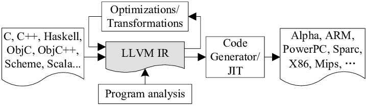

## 中间代码生成

我们通过前序遍历AST递归地生成目标代码。使用LLVM API，我们可以轻松地构建出LLVM IR作为中间代码。

### 1 LLVM简介

LLVM是一套编译器基础设施项目，包含一系列模块化的编译器组件和工具链，为开发编译器前端和后端提供了许多便利。LLVM将前端与后端做了解耦，将代码优化等步骤统一放到LLVM IR的分析中，使得我们的工作集中在frontend的实现上。



LLVM IR是LLVM工作流中的核心。它是一种类似RISC汇编的语言表示，但是引入了强类型检查，并自动编号管理寄存器与label。此外，对于常用功能（比如载入参数 + call调用函数），LLVM IR也提供了语法的包装，令它具有比汇编更强的抽象能力。下面是Wikipedia给出的 LLVM IR 版 hello world 示例：

```
@.str = internal constant [14 x i8] c"hello, world\0A\00"

declare i32 @printf(i8*, ...)

define i32 @main(i32 %argc, i8** %argv) nounwind {
entry:
    %tmp1 = getelementptr [14 x i8], [14 x i8]* @.str, i32 0, i32 0
    %tmp2 = call i32 (i8*, ...) @printf( i8* %tmp1 ) nounwind
    ret i32 0
}
```

### 2 实现细节

IR生成功能由两部分完成。我们创建Generator类维护构建的全局信息，各属性的作用会在下文详细介绍：

```cpp
class Generator {
public:
    llvm::Module *module;  // llvm 运行时环境
    llvm::Function *printf, *scanf;  // 保存调用的外部函数
    stack<llvm::Function*> funcStack; // 维护函数信息的栈
    stack<std::pair<llvm::BasicBlock*, llvm::BasicBlock*> > loopStack;
    	// 维护循环信息的栈
    SymStack* symStack; // 维护符号表
    int brSet = 0; // 维护BasicBlock的退出信息
};
```

而IR生成的具体工作在每个Node的codeGen函数中完成，只需要先序遍历AST的同时执行codeGen。

```cpp
void Generator::generate(Node* root)
{
    root->codeGen();
    if(hasError) return;
    this->module->print(llvm::outs(), nullptr);
}

llvm::Value* Node::codeGen()
{
    record essential information to Generator;
    for node in childs
        node.codeGen();
    build self IR code;
}
```

#### 2.1 符号表实现

llvm提供了getValueSymbolTable的接口，但是llvm只为函数维护符号表，而在C语言中局部变量可以定义在大括号对（我们称之为Compound Statements）之中。因此我们自己维护了一份符号表：

```cpp
// SymStack.h

class SymItem {
public:
    SymItem(llvm::Type* ty, bool isArray, bool isConstant, int size, llvm::Value* addr): ty(ty), isArray(isArray), isConstant(isConstant), size(size), addr(addr) {}
    llvm::Type* ty;
    bool isArray;
    bool isConstant;
    int size;
    llvm::Value* addr;
};

class SymMap {
public:
    SymItem* find(std::string name);
    void add(...);
private:
    std::map<std::string, SymItem*> mp;
};

class SymStack {
public:
    SymItem* find(std::string name);
    SymItem* findCur(std::string name);
    void add(...);
    void create();
    void remove();
    ~SymStack();
private:
    std::vector<SymMap*> mapStack;
};
```

符号表以SymStack形式维护在generator中，作为全局信息使用。Stack中存储了若干层变量作用域，每个作用域由一个map结构维护 <变量名，变量信息> 。

在开始构建一个Compound Statements时，使用create方法在栈顶插入一个空的map，令其记录之后新声明的变量。在构建结束时调用remove弹栈，结束这一批变量的生命周期。每次要查询变量时，从栈顶向下查询，返回第一个结果，即实现了局部变量对全局变量的覆盖。

每条记录SymIten中，记录了变量的类型、大小等。比较关键的是属性addr，它有三种情况：

+ 对于普通的变量，addr存放地址，取值可以通过load指令实现；
+ 对于常量，addr直接存储值，在使用的时候直接替换；
+ 对于函数形参，地址由LLVM自行管理，addr设为null，可以在LLVM默认符号表里查询。

#### 2.2 变量/常量/函数实现

变量与常量在AST中解析为Identifier节点， 支持integer（32位），real（双精度），char和bool类型以及对应的数组：

```cpp
class Identifier: public ExprNode {
public:
 	...
    llvm::Value* codeGen() override;
    llvm::Value* addrGen();
    std::string name;
    ExprNode* index;
    int len;
};
```

核心属性是name与index，name即是变量名，而index在有方括号下标时记录下标信息。由于从ExprNode类中解析出的值难以检查类型和直接使用，不允许使用表达式下标**定义**数组。在定义时额外使用len属性，这样可以保证声明的合法性。

注意到我们在codeGen之外又实现了addrGen属性，因为在赋值或输入时需要变量的地址而不是值。在使用常量和变量名时，查询上述的符号表即可获得地址，在此基础上使用load指令获取值。

函数的返回值除了上述4种外，也支持void类型。函数的管理在LLVM中实现的很完善，所以我们没有另外维护，也允许变量与函数重名。函数形参的声明与调用与变量基本一致，调用函数则使用LLVM提供的call功能。

#### 2.3 运算赋值实现

LLVM提供的运算指令非常丰富，我们实现了常见的二元运算符，包括加减乘除、取模、大于（等于）、小于（等于）、（不）等于和逻辑（and、or）运算。

基于上述的变量实现，赋值运算也比较简单：

```cpp
AssignStmtNode::codeGen()
{
    llvm::Value* l = lhs->addrGen();
    // lhs is identifier
    llvm::Value* r = rhs->codeGen();
    // rhs is expression
    store r in l;
}
```

伪代码省略了一个细节：在赋值和运算中，可能出现运算双方类型不一致的情况。因此还需要实现基本的type cast功能。Char类型与bool类型实际上是低位宽的整数类型（分别为8bit与1bit）。因此使用了以下四类LLVM类型转换：

+ SIToFP：有符号整数转化为浮点数
+ FPToSI：浮点数转化为有符号整数
+ Trunc：高位整数向低位截取
+ ZExt：低位整数扩展到高位

类型转换遵循以下原则

+ 在赋值运算时，将 $r$ 的值向 $l$ 的类型转换
+ 在逻辑二元运算时，向bool转换
+ 在算数运算时，若有浮点运算元则转向浮点数，否则向位宽较高的运算元类型转换

#### 2.4 控制语句实现

我们实现了if和while语句，提供基本的程序流程控制。在LLVM IR中，控制语句通过label和跳转指令实现。

If语句的LLVM IR实现如下：

```
main:
  br i1 cond, label %then, label %else

then:                                             ; preds = %main
  then part
  br label %merge

else:                                             ; preds = %main
  else part
  br label %merge

merge:                                            ; preds = %then, %else
  some instructions...
```

创建then、else和merge三个BasicBlock，使用setInsertPoint可以改变当前写入的block。我们分别构建then和else block后写入跳转指令，再将insertPoint设在merge就可以继续正常写入IR。

While语句的LLVM IR实现如下，与if非常相似：

```
main:
  br label %check

check:                                            ; preds = %loop, %main
  calculate cond
  br i1 cond, label %loop, label %loop_end

loop:                                             ; preds = %check
  loop part
  br label %check

loop_end:                                         ; preds = %check
  some instructions...
```

基于label机制，break和continue不难实现：break即是跳转至loop_end，continue即是跳转到check。不过注意到while语句可能嵌套使用，break/continue只对最近一层循环生效，我们需要记录当前构建的while。这在generator中由loopStack维护。

LLVM机制还提出了新的问题。在LLVM中，每个BasicBlock都由唯一一个跳转语句结尾。没有或多次跳转都是非法的，这也是为什么上述While示例有个似乎无用的main $\to$ check的跳转。因此在构建直接跳转的语句时（包括break、continue和return），generator中的brSet会记录，并取消该block默认跳转语句的写入。在我们的编译器中，跳转语句标志着compound statements的结束，之后的指令将会触发编译错误——考虑到它们永远不会执行，这是合理的。

这里给出优化跳转语句的一个实例：

```cpp
a = 1
while(a < N)
{
    a = a * 2;
    if(a < 60) continue;
    print(a);
}

=>
    
FuncEntry:
  store i32 1, i32* @a, align 4
  br label %check

check:                                            ; preds = %merge, %then, %FuncEntry
  %1 = load i32, i32* @a, align 4
  %2 = load i32, i32* @N, align 4
  %3 = icmp sle i32 %1, %2
  br i1 %3, label %loop, label %loop_end

loop:                                             ; preds = %check
  %4 = load i32, i32* @a, align 4
  %5 = mul i32 %4, 2
  store i32 %5, i32* @a, align 4
  %6 = load i32, i32* @a, align 4
  %7 = icmp slt i32 %6, 60
  br i1 %7, label %then, label %else

loop_end:                                         ; preds = %check
  ret void

then:                                             ; preds = %loop
  br label %check

else:                                             ; preds = %loop
  br label %merge

merge:                                            ; preds = %else
  %8 = load i32, i32* @a, align 4
  %9 = call i32 (i8*, ...) @printf(...)
  br label %check
```

#### 2.5 输入输出实现

输入输出的实现不涉及到许多编译原理知识，但是处理起来有很多情况需要处理。因此我们选择简化的处理方式：将其声明为第三方函数，包装scanf/printf库函数。我们的类型系统很简单，所以我们取消了输出格式的显式指定，由AST Node进行判断，让函数调用更加简单：

```cpp
int i;
double d;
char[10] c;
scan(i, d, c);
print("Input is ", i, d, c);
```

