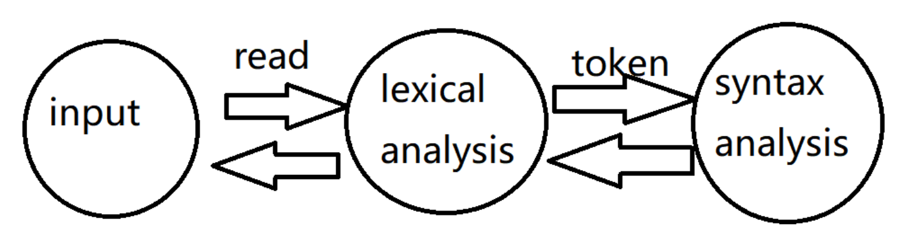
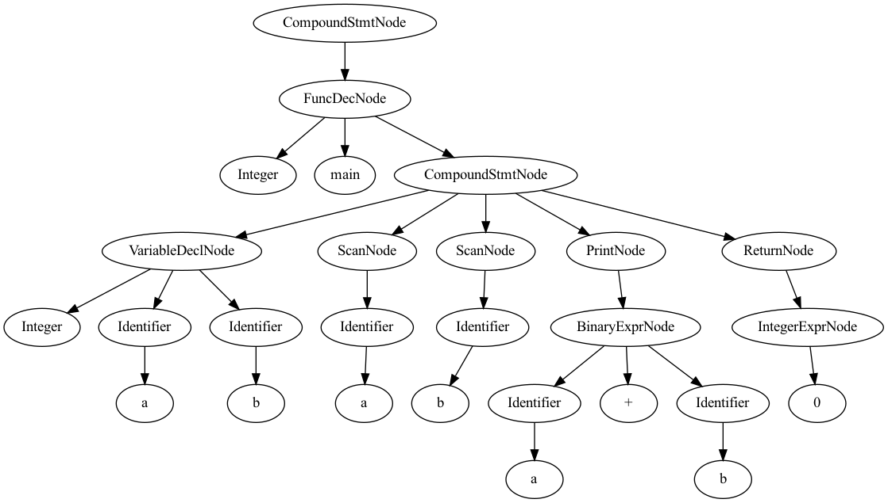

# G-Compiler: Project Report

[TOC]

## 1  项目概述

G-Compiler是使用C++语言、前后端分离开发的一款简易编译器。它的目标语言是一种**类C**语言——除了**输入输出**语法有所优化外，其他语句均为合法的C语句，支持的主要功能有：

+ 基本数据类型**int**、**double**、**char**、**bool**
+ 基于上述数据类型的变量、常量和数组定义
+ 基本的二元运算符，包括算术运算、逻辑运算和比较运算
+ 函数的定义、调用，支持递归
+ **If**语句和**While**语句，支持嵌套使用，并定义了**break**和**continue**关键字
+ ……

G-Compiler使用lex&yacc进行词法、语法分析，构建AST，到可执行文件的转换使用了LLVM框架。

我们将代码托管在Github进行管理：[项目地址](https://github.com/Cupcake416/G-Compiler)

### 运行环境

本文档中所有的测试都在 Ubuntu 20.04.4 (X86_64) 系统完成，使用了以下依赖：

+ g++: version 9.4.0
+ LLVM: version 15.0.0
+ graphviz: version 2.43.0

### 文件结构

```
G-Compiler
├── doc # 报告文档
├── src  # 源码
│   ├── ast # AST定义及可视化
│      ├── ... 
│   ├── parser # lex & yacc
│      ├── ...
│   ├── code_gen # 中间代码生成
│      ├── ...
│   ├── compiler.cpp # G-Compiler主文件
│   ├── Makefile
├── test  # 测试文件
│   ├── QuickSort
│   ├── Matrix
│   ├── AutoAdvisor
└── .gitignore
└── Readme.md
```

### 运行说明

在src文件夹下执行make命令编译compiler。

执行make test target=<filename> 编译指定文件，生成名为exe的可执行文件，在src/ast中生成可视化结果ast_vis.png。

## 2 语法分析

词法分析是将字符序列转换为标记(token)序列的过程。在词法分析阶段，编译器会先输入要求源程序字符串流，之后将字符流转换为规定好的标记序列，同时将所需要的信息存储起来，最后将结果交给语法分析器进行下一步编译的过程。

语法分析（英语：syntactic analysis，也叫parsing）是根据某种给定的形式⽂法对由单词序列（如英语单词序列）构成的输⼊文本进行分析并确定其语法结构的⼀种过程。

G-compiler使用Lex (flex) 和 Yacc (Bison) 工具完成词法分析与语法分析，并构建语法分析树。

### 2.1  Lex & Yacc 简介

flex（快速词法分析产⽣器，fast lexical analyzer generator）是⼀种词法分析程序。它是lex的开放源代码版本，以BSD许可证发布。通常与GNU bison⼀同运作。标准lex文件由三部分组成，分别是定义区、规则区和用户子过程区。在定义区，用户可以编写C语言中的声明语句，导入需要的头文件或声明变量。在规则区，用户需要编写以正则表达式和对应的动作的形式的说明等价规则的代码。在用户子过程区自定义函数。完成一种如下形式的定义：

```
{definitions}
%%
{rules}
%%
{subroutines}
```

YACC是Unix/Linux上用于生成编译器语言的编译器生成器，它使用BNF定义语法，能处理上下文无关文法(context-free)。YACC生成的编译器主要是用C语言写成的语法解析器(Parser)，需要与词法解析器Lex⼀起使用，并配合把两部分产生出来的C程序⼀并编译。定义标准与flex类似，也是由声明区、规则区、程序区三部分构成。

Flex和Yacc的工作流程如图所示：



### 2.2 实现细节

G-Compiler定义的token有下列几种（按匹配优先级排序）：

+ 单行注释

  ```
  COMMENT \/\/[^\n]*
  ```

+ 关键字

  ```
  CONST const
  RETURN return
  IF if
  ELSE else
  WHILE while
  BREAK break
  CONTINUE continue
  VOID void
  SCAN scan
  PRINT print
  
  SEMI ;
  COMMA ,
  ASSIGNOP =
  LP \(
  RP \)
  LB \[
  RB \]
  LC \{
  RC \}
  ```

+ 运算符，按照运算优先级划分

  ```
  OP_0 "*"|"/"
  OP_1 "%"
  OP_2 "+"|"-"
  OP_3 ">"|"<"|">="|"<="|"=="|"!="
  OP_4 "&&"
  OP_5 "||"
  ```

+ ⽤户定义的标志符（identifier）、数字常量（整型和浮点数）、字符串常量等。

  ```
  digits [0-9]+
  
  CHAR  \'.\'|\'\\.\'
  STRING \"(\\.|[^"\\])*\"
  INT -?(0|[1-9][0-9]*)
  REAL -?({digits}\.{digits})
  BOOL "true"|"false"
  TYPE "int"|"double"|"bool"|"char"
  
  ID [_a-zA-Z][_0-9a-zA-Z]*
  BLANK \t|" "|\r|\n
  ```

token由lex解析，存储值则在yacc文件中定义。其中转义字符的解析需要特别处理，目前只实现了几个常用的转义字符解析：

```
int str2ch(std::string str)
{
	// str is 'c' or '\c'
    if(str[1] != '\\') return str[1];
    else if (str[2] == 'n') return '\n';
    else if (str[2] == 'r') return '\r';
    else if (str[2] == 't') return '\t';
    else if (str[2] == '\\') return '\\';
    else if (str[2] == '\'') return '\'';
    else if (str[2] == '"') return '\"';
    else if (str[2] == '0') return '\0';
    else return 128;
}
```

yacc部分的主要工作是调用AST Node的构造函数、建立AST，篇幅较长，此处不做赘述，可参考“抽象语法树”部分和源代码。

## 3  抽象语法树

### 3.1  抽象语法树的结构定义

#### Node类

Node类是抽象语法树中所有节点的共同祖先。Node类是一个抽象类，拥有三个虚函数，分别是codeGen，dotGen和getClass，用于生成中间代码,生成DOT语言脚本和获得类名。

```c++
class Node {
public: 
    virtual llvm::Value* codeGen() = 0;
    virtual void dotGen(std::string *dot) {
        return;
    };
    virtual std::string getClass() = 0;
};
```

#### ExprNode和StmtNode类

我们将各种实体类分为两大部分，分别继承自ExprNode和StmtNode。ExprNode类表示表达式类，它的子类表示一个值或者可被指定一个值，比如变量。StmtNode类表示语句类，该类的特征是会进行操作，如赋值，定义变量等。

```c++
class StmtNode: public Node {

};

// expr也可以看做stmt，1+1; 是合法语句
// 这样方便函数与过程的统一调用
class ExprNode: public StmtNode {

};
```

#### 标识符

用Identifier类来表示一个标识符，其中包含一个name字段和index字段。name表示变量名。当Identifier表示一个数组元素时，index字段用于表示数组下标。

```c++
//  For variable/function, only 'name' needed
//  For arrays,
// 解析表达式时，下标由index输入，如 A[i] = 0;
// 解析定义时，长度由len输入，如 int A[10];
class Identifier: public ExprNode {
public:
    Identifier(std::string name, ExprNode* index = nullptr, int len = -1): name(name), index(index), len(len) {}
    llvm::Value* codeGen() override;
    llvm::Value* addrGen();
    void dotGen(std::string *dot) override;
    std::string getClass() override {return "Identifier";}
    std::string name;
    ExprNode* index;
    int len;
};
```

#### 常量

ConstExprNode类表示一个常量。其下有四个子类IntegerExprNode、DoubleExprNode、CharExprNode和BooleanExprNode，分别表示对应类型的常量。

```c++
class ConstExprNode: public ExprNode {
public:
    union Value {
        int i;
        double d;
        char c;
        bool b;
    };
    virtual Value getValue() = 0;
    void dotGen(std::string *dot) override;
};
```

```c++
class IntegerExprNode: public ConstExprNode {
public:
    IntegerExprNode(int value): value(value) {}
    virtual ConstExprNode::Value getValue() override {
        Value v;
        v.i = value;
        return v;
    }
    llvm::Value* codeGen() override;
    void dotGen(std::string *dot) override;
    std::string getClass() override {return "IntegerExprNode";}
private:
    int value;
};
```

#### 常量声明和变量声明

ConstDeclNode表示常量声明节点，用变量名（name），常量表达式（value）和常量类型（type）组成。VariableDeclNode表示常量声明节点，与常量声明的区别是去掉了常量表达式（value），同时储存多个变量名，支持一次声明多个变量。

```c++
class ConstDeclNode: public StmtNode {
public: 
    ConstDeclNode(Identifier *id, ConstExprNode *value, NodeType type): name(id), value(value), type(type) {}
    llvm::Value* codeGen() override;
    void dotGen(std::string *dot) override;
    std::string getClass() override {return "ConstDeclNode";}
private:
    Identifier *name;
    ConstExprNode *value;
    NodeType type;
};
```

```c++
class VariableDeclNode: public StmtNode {
public:
    VariableDeclNode(std::vector<Identifier*> *nameList, NodeType type): nameList(nameList), type(type) {}
    llvm::Value* codeGen() override;
    void dotGen(std::string *dot) override;
    std::string getClass() override {return "VariableDeclNode";}
private:
    std::vector<Identifier*> *nameList;
    NodeType type;
};
```

NodeType定义如下：

```c++
enum NodeType {
    TYPE_INT,
    TYPE_REAL,
    TYPE_CHAR,
    TYPE_BOOL
};
```

#### 函数声明和调用

FuncDecNode和CallExprNode分别表示函数的声明和调用语句。

FuncDecNode包含函数名，返回值类型，参数列表和函数体：

```c++
class FuncDecNode: public StmtNode {
public:
    FuncDecNode(Identifier* name, FuncType type, std::vector<std::pair<NodeType, Identifier*> > *argList, CompoundStmtNode* body): name(name), type(type), argList(argList), body(body) {}
    llvm::Value* codeGen() override;
    void dotGen(std::string *dot) override;
    std::string getClass() override {return "FuncDecNode";}
private:
    Identifier* name;
    FuncType type;  // return type
    std::vector<std::pair<NodeType, Identifier*> > *argList; // set to null if no args
    CompoundStmtNode* body;
};
```

CallExprNode包含调用函数名和参数列表：

```c++
class CallExprNode: public ExprNode {
public:
    CallExprNode(Identifier* callee, std::vector<ExprNode*> *args): callee(callee), args(args) {}
    llvm::Value* codeGen() override;
    void dotGen(std::string *dot) override;
    std::string getClass() override {return "CallExprNode";}
private:
    Identifier* callee;
    std::vector<ExprNode*> *args;
};
```

#### 复合语句

复合语句表示一系列语句，包含一个语句列表

```c++
class CompoundStmtNode : public StmtNode {
public:
    CompoundStmtNode(std::vector<StmtNode*> *stmtList) : stmtList(stmtList) {}
    llvm::Value* codeGen() override;
    void dotGen(std::string *dot) override;
    std::string getClass() override {return "CompoundStmtNode";}
private:
    std::vector<StmtNode*> *stmtList;
};
```

#### 其他语句

上面介绍了基本的顶层类和几个重要的底层类，其他语句如二元运算符、赋值语句、控制语句、输入输出语句的实现大同小异，不作详细介绍。

### 3.2  抽象语法树的可视化

我们使用Graphviz实现抽象语法树的可视化。Graphviz是一个开源工具包，用于绘制DOT语言脚本描述的图形。首先调用Visualization类中的dotGen函数生成DOT语言的框架，然后调用每个AST节点中的dotGen函数获得完整的DOT语言脚本。

Visualization类中的dotGen函数：

```c++
std::string Visualization::dotGen(Node *root) {
    std::string dot = "";
    dot += "digraph G{\n";
    dot += "n" + std::to_string(nodeNum) + " [label=" + root->getClass() + "]\n";
    root->dotGen(&dot);
    dot += "}\n";
    return dot;
}
```

AST节点中的dotGen函数（以BinaryExprNode为例）：

```c++
void BinaryExprNode::dotGen(std::string *dot) {
    std::string fromName = getClass();
    int rootNum = nodeNum;
    if(lhs != nullptr) {
        nodeNum += 1;
        *dot += "n" + std::to_string(nodeNum) + " [label=" + lhs->getClass() + "]\n";
        *dot += "n" + std::to_string(rootNum) + "->n" + std::to_string(nodeNum) + "\n";
        lhs->dotGen(dot);
    }
    if(rhs != nullptr) {
        nodeNum += 1;
        *dot += "n" + std::to_string(nodeNum) + " [label=" + rhs->getClass() + "]\n";
        *dot += "n" + std::to_string(rootNum) + "->n" + std::to_string(nodeNum) + "\n";
        rhs->dotGen(dot);
    }
    return;
}
```

可视化结果示例如下：



## 4  中间代码生成

我们通过前序遍历AST递归地生成目标代码。使用LLVM API，我们可以轻松地构建出LLVM IR作为中间代码。

### 4.1  LLVM简介

LLVM是一套编译器基础设施项目，包含一系列模块化的编译器组件和工具链，为开发编译器前端和后端提供了许多便利。LLVM将前端与后端做了解耦，将代码优化等步骤统一放到LLVM IR的分析中，使得我们的工作集中在frontend的实现上。


LLVM IR是LLVM工作流中的核心。它是一种类似RISC汇编的语言表示，但是引入了强类型检查，并自动编号管理寄存器与label。此外，对于常用功能（比如载入参数 + call调用函数），LLVM IR也提供了语法的包装，令它具有比汇编更强的抽象能力。下面是Wikipedia给出的 LLVM IR 版 hello world 示例：

```
@.str = internal constant [14 x i8] c"hello, world\0A\00"

declare i32 @printf(i8*, ...)

define i32 @main(i32 %argc, i8** %argv) nounwind {
entry:
    %tmp1 = getelementptr [14 x i8], [14 x i8]* @.str, i32 0, i32 0
    %tmp2 = call i32 (i8*, ...) @printf( i8* %tmp1 ) nounwind
    ret i32 0
}
```

### 4.2  实现细节

IR生成功能由两部分完成。我们创建Generator类维护构建的全局信息，各属性的作用会在下文详细介绍：

```cpp
class Generator {
public:
    llvm::Module *module;  // llvm 运行时环境
    llvm::Function *printf, *scanf;  // 保存调用的外部函数
    stack<llvm::Function*> funcStack; // 维护函数信息的栈
    stack<std::pair<llvm::BasicBlock*, llvm::BasicBlock*> > loopStack;
    	// 维护循环信息的栈
    SymStack* symStack; // 维护符号表
    int brSet = 0; // 维护BasicBlock的退出信息
};
```

而IR生成的具体工作在每个Node的codeGen函数中完成，只需要先序遍历AST的同时执行codeGen。

```cpp
void Generator::generate(Node* root)
{
    root->codeGen();
    if(hasError) return;
    this->module->print(llvm::outs(), nullptr);
}

llvm::Value* Node::codeGen()
{
    record essential information to Generator;
    for node in childs
        node.codeGen();
    build self IR code;
}
```

#### 4.2.1 符号表实现

llvm提供了getValueSymbolTable的接口，但是llvm只为函数维护符号表，而在C语言中局部变量可以定义在大括号对（我们称之为Compound Statements）之中。因此我们自己维护了一份符号表：

```cpp
// SymStack.h

class SymItem {
public:
    SymItem(llvm::Type* ty, bool isArray, bool isConstant, int size, llvm::Value* addr): ty(ty), isArray(isArray), isConstant(isConstant), size(size), addr(addr) {}
    llvm::Type* ty;
    bool isArray;
    bool isConstant;
    int size;
    llvm::Value* addr;
};

class SymMap {
public:
    SymItem* find(std::string name);
    void add(...);
private:
    std::map<std::string, SymItem*> mp;
};

class SymStack {
public:
    SymItem* find(std::string name);
    SymItem* findCur(std::string name);
    void add(...);
    void create();
    void remove();
    ~SymStack();
private:
    std::vector<SymMap*> mapStack;
};
```

符号表以SymStack形式维护在generator中，作为全局信息使用。Stack中存储了若干层变量作用域，每个作用域由一个map结构维护 <变量名，变量信息> 。

在开始构建一个Compound Statements时，使用create方法在栈顶插入一个空的map，令其记录之后新声明的变量。在构建结束时调用remove弹栈，结束这一批变量的生命周期。每次要查询变量时，从栈顶向下查询，返回第一个结果，即实现了局部变量对全局变量的覆盖。

每条记录SymIten中，记录了变量的类型、大小等。比较关键的是属性addr，它有三种情况：

+ 对于普通的变量，addr存放地址，取值可以通过load指令实现；
+ 对于常量，addr直接存储值，在使用的时候直接替换；
+ 对于函数形参，地址由LLVM自行管理，addr设为null，可以在LLVM默认符号表里查询。

#### 4.2.2 变量/常量/函数实现

变量与常量在AST中解析为Identifier节点， 支持integer（32位），real（双精度），char和bool类型以及对应的数组：

```cpp
class Identifier: public ExprNode {
public:
 	...
    llvm::Value* codeGen() override;
    llvm::Value* addrGen();
    std::string name;
    ExprNode* index;
    int len;
};
```

核心属性是name与index，name即是变量名，而index在有方括号下标时记录下标信息。由于从ExprNode类中解析出的值难以检查类型和直接使用，不允许使用表达式下标**定义**数组。在定义时额外使用len属性，这样可以保证声明的合法性。

注意到我们在codeGen之外又实现了addrGen属性，因为在赋值或输入时需要变量的地址而不是值。在使用常量和变量名时，查询上述的符号表即可获得地址，在此基础上使用load指令获取值。

函数的返回值除了上述4种外，也支持void类型。函数的管理在LLVM中实现的很完善，所以我们没有另外维护，也允许变量与函数重名。函数形参的声明与调用与变量基本一致，调用函数则使用LLVM提供的call功能。

#### 4.2.3 运算赋值实现

LLVM提供的运算指令非常丰富，我们实现了常见的二元运算符，包括加减乘除、取模、大于（等于）、小于（等于）、（不）等于和逻辑（and、or）运算。

基于上述的变量实现，赋值运算也比较简单：

```cpp
AssignStmtNode::codeGen()
{
    llvm::Value* l = lhs->addrGen();
    // lhs is identifier
    llvm::Value* r = rhs->codeGen();
    // rhs is expression
    store r in l;
}
```

伪代码省略了一个细节：在赋值和运算中，可能出现运算双方类型不一致的情况。因此还需要实现基本的type cast功能。Char类型与bool类型实际上是低位宽的整数类型（分别为8bit与1bit）。因此使用了以下四类LLVM类型转换：

+ SIToFP：有符号整数转化为浮点数
+ FPToSI：浮点数转化为有符号整数
+ Trunc：高位整数向低位截取
+ ZExt：低位整数扩展到高位

类型转换遵循以下原则

+ 在赋值运算时，将 $r$ 的值向 $l$ 的类型转换
+ 在逻辑二元运算时，向bool转换
+ 在算数运算时，若有浮点运算元则转向浮点数，否则向位宽较高的运算元类型转换

#### 4.2.4 控制语句实现

我们实现了if和while语句，提供基本的程序流程控制。在LLVM IR中，控制语句通过label和跳转指令实现。

If语句的LLVM IR实现如下：

```
main:
  br i1 cond, label %then, label %else

then:                                             ; preds = %main
  then part
  br label %merge

else:                                             ; preds = %main
  else part
  br label %merge

merge:                                            ; preds = %then, %else
  some instructions...
```

创建then、else和merge三个BasicBlock，使用setInsertPoint可以改变当前写入的block。我们分别构建then和else block后写入跳转指令，再将insertPoint设在merge就可以继续正常写入IR。

While语句的LLVM IR实现如下，与if非常相似：

```
main:
  br label %check

check:                                            ; preds = %loop, %main
  calculate cond
  br i1 cond, label %loop, label %loop_end

loop:                                             ; preds = %check
  loop part
  br label %check

loop_end:                                         ; preds = %check
  some instructions...
```

基于label机制，break和continue不难实现：break即是跳转至loop_end，continue即是跳转到check。不过注意到while语句可能嵌套使用，break/continue只对最近一层循环生效，我们需要记录当前构建的while。这在generator中由loopStack维护。

LLVM机制还提出了新的问题。在LLVM中，每个BasicBlock都由唯一一个跳转语句结尾。没有或多次跳转都是非法的，这也是为什么上述While示例有个似乎无用的main $\to$ check的跳转。因此在构建直接跳转的语句时（包括break、continue和return），generator中的brSet会记录，并取消该block默认跳转语句的写入。在我们的编译器中，跳转语句标志着compound statements的结束，之后的指令将会触发编译错误——考虑到它们永远不会执行，这是合理的。

这里给出优化跳转语句的一个实例：

```cpp
a = 1
while(a < N)
{
    a = a * 2;
    if(a < 60) continue;
    print(a);
}

=>
    
FuncEntry:
  store i32 1, i32* @a, align 4
  br label %check

check:                                            ; preds = %merge, %then, %FuncEntry
  %1 = load i32, i32* @a, align 4
  %2 = load i32, i32* @N, align 4
  %3 = icmp sle i32 %1, %2
  br i1 %3, label %loop, label %loop_end

loop:                                             ; preds = %check
  %4 = load i32, i32* @a, align 4
  %5 = mul i32 %4, 2
  store i32 %5, i32* @a, align 4
  %6 = load i32, i32* @a, align 4
  %7 = icmp slt i32 %6, 60
  br i1 %7, label %then, label %else

loop_end:                                         ; preds = %check
  ret void

then:                                             ; preds = %loop
  br label %check

else:                                             ; preds = %loop
  br label %merge

merge:                                            ; preds = %else
  %8 = load i32, i32* @a, align 4
  %9 = call i32 (i8*, ...) @printf(...)
  br label %check
```

#### 4.2.5 输入输出实现

输入输出的实现不涉及到许多编译原理知识，但是处理起来有很多情况需要处理。因此我们选择简化的处理方式：将其声明为第三方函数，包装scanf/printf库函数。我们的类型系统很简单，所以我们取消了输出格式的显式指定，由AST Node进行判断，让函数调用更加简单：

```cpp
int i;
double d;
char[10] c;
scan(i, d, c);
print("Input is ", i, d, c);
```

## 5  测试

### 5.1 应用测试

编写快速排序、矩阵乘法和选课推荐程序检查编译器功能，代码在test文件夹中。

所有代码都通过了tester测试。

**快速排序**示例输入：

```
5
0
-2
1
2
-1
```


**矩阵乘法**示例输入：

```
4 1
   123
   345
   567
   789
1 4
  -123   345  -567   789
```


```
2 2
     1     2
     3     4
3 1
     1
     2
     3
```


**选课推荐**示例输入：

```
"验收细则"中的第三个样例
```


### 5.2  错误检查

```cpp
int x$;
```


```cpp
int main()
{
    const int C = 1;
    int L[10];
    L = 1;
    C = 1;
    return 0;
}
```


```cpp
int main()
{
    const int C = 1;
    int C;
    return 0;
}

double main() {}
```


```cpp
int f(int x) {return x;}

int main()
{
    print(f(1, 1));
    return 0;
}
```


```cpp
int main()
{
    continue;
    while(1)
    {
        int x;
        break;
        x = 1;
    }
    return 0;
}
```


此外，我们对手写的符号表也进行了测试。可以看到，符号表顺利完成了全局/局部变量的管理：

```cpp
const int x = 0;

void f1(int x)
{
    print(x, "\n");
}

void f2()
{
    print(x, "\n");
}

int main()
{
    int x; x = 1;
    {
        int x; x = 2;
        f1(x); f2();
    }
    print(x, "\n");
    return 0;
}
```


