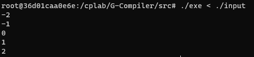
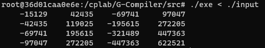
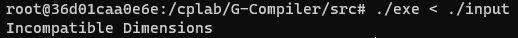
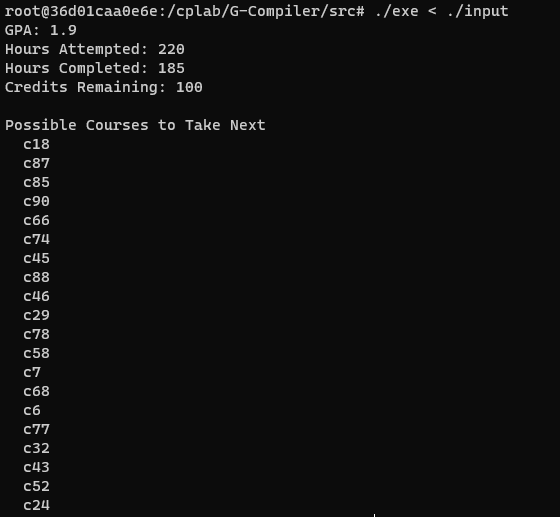
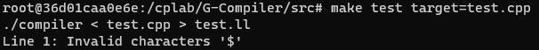
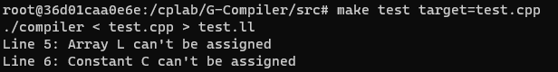
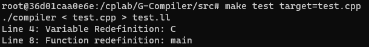
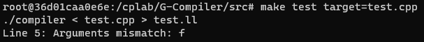
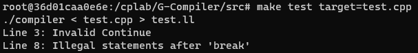
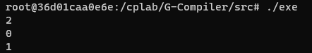

## 测试

### 1 应用测试

编写快速排序、矩阵乘法和选课推荐程序检查编译器功能，代码在test文件夹中。

所有代码都通过了tester测试。

**快速排序**示例输入：

```
5
0
-2
1
2
-1
```



**矩阵乘法**示例输入：

```
4 1
   123
   345
   567
   789
1 4
  -123   345  -567   789
```



```
2 2
     1     2
     3     4
3 1
     1
     2
     3
```



**选课推荐**示例输入：

```
"验收细则"中的第三个样例
```



### 2 错误检查

```cpp
int x$;
```



```cpp
int main()
{
    const int C = 1;
    int L[10];
    L = 1;
    C = 1;
    return 0;
}
```



```cpp
int main()
{
    const int C = 1;
    int C;
    return 0;
}

double main() {}
```



```cpp
int f(int x) {return x;}

int main()
{
    print(f(1, 1));
    return 0;
}
```



```cpp
int main()
{
    continue;
    while(1)
    {
        int x;
        break;
        x = 1;
    }
    return 0;
}
```



此外，我们对手写的符号表也进行了测试。可以看到，符号表顺利完成了全局/局部变量的管理：

```cpp
const int x = 0;

void f1(int x)
{
    print(x, "\n");
}

void f2()
{
    print(x, "\n");
}

int main()
{
    int x; x = 1;
    {
        int x; x = 2;
        f1(x); f2();
    }
    print(x, "\n");
    return 0;
}
```



